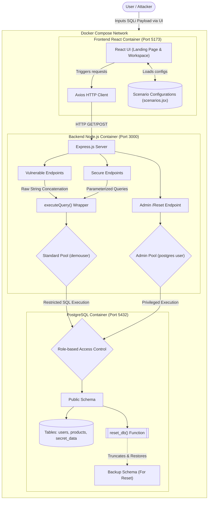

# SQL Injection Interactive Sandbox and Educational Demo

An educational, interactive web application designed to teach developers, QA engineers, and cybersecurity students about SQL Injection (SQLi) vulnerabilities through hands-on, side-by-side practical learning.

## Problem Statement

SQL Injection (SQLi) remains one of the most critical and widespread vulnerabilities in modern web applications. It occurs when an application improperly concatenates user input directly into database queries, allowing malicious actors to alter the query's underlying structure. This can lead to unauthorized data access, authentication bypass, data loss, or full database compromise.

Many developers learn about SQL injection theoretically but lack a safe, practical environment to see exactly how these attacks manipulate the database and why defensive mechanisms effectively prevent them. This project provides a safe, ephemeral environment to test payloads against both vulnerable and secure implementations side-by-side.

## System Architecture

The application is built using a containerized microservices architecture with three primary components:

The system is orchestrated using Docker Compose. 
- The **Frontend** serves a React single-page application.
- The **Backend** is an Express Node.js server that handles API requests, executing queries against the database.
- The **Database** is a PostgreSQL instance initialized with pre-populated dummy data and restricted user permissions.

## Whole Codebase Workflow

1. **Initialization:** Docker Compose spins up the Database, Backend, and Frontend containers. The Database container runs an initialization script that creates the schema, populates data, and sets up a secure reset mechanism.
2. **User Interaction:** The user accesses the React Frontend on port 5173. They are presented with a landing page listing educational scenarios.
3. **Scenario Selection:** Upon selecting a scenario, the user enters the workspace where they can input a payload.
4. **Execution:** The user can execute the payload against a "Vulnerable" endpoint, a "Secure" endpoint, or both simultaneously.
5. **Processing:** The React app sends the respective GET/POST requests to the Node.js Backend.
6. **Querying:** The Backend uses the input to construct SQL queries. The vulnerable endpoints use unsafe string concatenation, while the secure endpoints use parameterized queries.
7. **Database Interaction:** The Backend connects to the PostgreSQL Database and executes the queries.
8. **Response:** The Backend measures execution time, catches any SQL errors, retrieves the rows, and sends a JSON response back to the Frontend.
9. **Display:** The Frontend renders the results side-by-side, displaying the raw SQL executed, the resulting data table or error message, and the backend code snippets for comparison.

## Backend and Frontend Whole Workflow

### Frontend Workflow
- **State Management:** The main `App` component manages whether the user is on the `LandingPage` or a specific `ScenarioWorkspace`.
- **Data Source:** Scenario configurations (titles, descriptions, vulnerable/secure code snippets, suggested payloads) are statically defined in `scenarios.jsx`.
- **Payload Input:** The `ScenarioWorkspace` dynamically renders input fields based on the selected scenario's configuration.
- **API Communication:** Using Axios, the frontend sends user inputs to the backend API (`/api/scenario/:id/vulnerable` and `/api/scenario/:id/secure`).
- **Result Visualization:** The `ResultPanel` component receives the response and visualizes the raw SQL query, the execution time, and either a table of returned records or a database error block.

### Backend Workflow
- **Connection Pools:** The backend establishes two database connection pools: a standard pool using a restricted `demouser` for executing scenario queries, and an admin pool for the database reset functionality.
- **Routing:** Express routes are defined for each scenario (A, B, and C) with paired `/vulnerable` and `/secure` endpoints.
- **Vulnerable Implementations:** In endpoints like `/api/scenario/a/vulnerable`, user input is directly concatenated into a SQL string.
- **Secure Implementations:** In endpoints like `/api/scenario/a/secure`, user input is passed as parameterized arrays to the database driver, preventing structural manipulation of the query.
- **Query Execution Wrapper:** A utility function `executeQuery` wraps the Postgres queries to catch errors gracefully and measure query execution time in milliseconds, returning a standardized response object to the frontend.
- **Database Reset:** An admin endpoint `/api/admin/reset` calls a stored PostgreSQL function to instantly restore the database tables to their original state if a user drops or modifies them.

## Directory and File Structure Breakdown

### Root Directory
- **`.git/`**: Version control directory containing Git repository data.
- **`.gitignore`**: Specifies files and directories that Git should ignore in the root.
- **`docker-compose.yml`**: The orchestration file that defines the three services (db, backend, frontend), their environment variables, port mappings, and volume mounts.
- **`README.md`**: The main documentation file (this file) describing the project, architecture, and workflows.

### `db/` - Database Configuration Directory
- **`init.sql`**: The initialization script that runs when the PostgreSQL container starts. It creates the `sqli_demo` database, creates users (`demouser`), sets up tables (`users`, `products`, `secret_data`), populates them with initial records, and creates a `backup_schema` and `reset_db()` function to allow easy resetting of the environment.

### `backend/` - Node.js Express Server Directory
- **`.gitignore`**: Specifies files and directories that Git should ignore in the backend.
- **`Dockerfile`**: Instructions for building the backend Docker image.
- **`index.js`**: The core application logic. It initializes the Express server, sets up PostgreSQL connection pools, defines the vulnerable and secure API endpoints for all scenarios, and includes the execution timer and error-catching wrapper.
- **`package.json`**: Defines Node.js dependencies (e.g., express, pg, cors) and project scripts.
- **`package-lock.json`**: Locks down the exact versions of backend dependencies.

### `frontend/` - React Client Application Directory
- **`.gitignore`**: Specifies files and directories that Git should ignore in the frontend.
- **`Dockerfile`**: Instructions for building the frontend Docker image using Vite.
- **`README.md`**: Documentation specific to the frontend application.
- **`eslint.config.js`**: Configuration file for ESLint to enforce code quality and styling rules.
- **`index.html`**: The main HTML template where the React application is injected.
- **`package.json`**: Defines frontend dependencies (e.g., react, axios, lucide-react) and scripts.
- **`package-lock.json`**: Locks down the exact versions of frontend dependencies.
- **`postcss.config.js`**: Configuration file for PostCSS, required by Tailwind.
- **`tailwind.config.js`**: Configuration file for the Tailwind CSS framework styling.
- **`vite.config.js`**: Configuration for the Vite build tool and development server.
- **`public/`**: Directory containing static assets that are served directly.
- **`src/`**: Directory containing the source code for the React application.
  - **`App.css`**: Application-specific stylesheet.
  - **`App.jsx`**: The root component that maintains the state to switch between the landing page and the active scenario workspace.
  - **`index.css`**: Global stylesheet containing Tailwind directives.
  - **`main.jsx`**: The entry point for React that renders the `App` component into the DOM.
  - **`assets/`**: Directory for images, icons, and other assets used in the source code.
  - **`components/`**
    - **`ResultPanel.jsx`**: A reusable component that formats and displays the query execution results, handling loading states, errors, data tables, and raw query visualization.
  - **`data/`**
    - **`scenarios.jsx`**: A configuration file storing the metadata, explanations, default inputs, suggested payloads, and code snippets for each of the SQL injection scenarios.
  - **`pages/`**
    - **`LandingPage.jsx`**: Renders the welcome screen and maps over the available scenarios to display selection cards.
    - **`ScenarioWorkspace.jsx`**: The interactive interface where users input payloads, trigger API calls, and view side-by-side execution results and backend code snippets.
