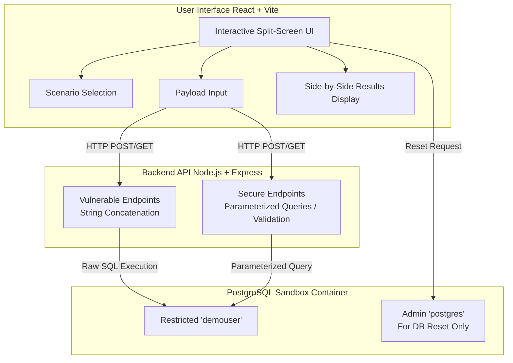

# 🛡️ SQL Injection Interactive Sandbox & Educational Demo

[](https://reactjs.org/)
[](https://vitejs.dev/)
[](https://nodejs.org/)
[](https://www.postgresql.org/)
[](https://www.docker.com/)

> An educational, interactive web application designed to teach developers, QA engineers, and cybersecurity students about SQL Injection (SQLi) vulnerabilities through hands-on, side-by-side practical learning.

---

## 🎯 The Problem

**SQL Injection (SQLi)** remains one of the most critical and widespread vulnerabilities in modern web applications. It occurs when an application improperly concatenates user input directly into database queries, allowing malicious actors to alter the query's underlying structure. This can lead to:
- 🔓 Unauthorized data access and authentication bypass
- 💸 Data loss or exfiltration
- 💥 Full database compromise

Many developers learn about SQL injection theoretically but lack a safe, practical environment to see exactly *how* these attacks manipulate the database and *why* defensive mechanisms effectively prevent them.

## 💡 The Solution

The **SQL Injection Interactive Demo** bridges this gap by providing an isolated, local sandbox where users can execute benign injection payloads and observe the results in real-time. 

Crucially, the application provides a split-screen **side-by-side comparison** of:
- 🔴 **Vulnerable Code**: Using dangerous string concatenation.
- 🟢 **Secure Code**: Using parameterized queries/prepared statements and proper validation.

This approach makes the abstract concepts of SQLi concrete, visible, and easy to understand.

---

## 🚀 How It Works

The application provides an intuitive split-screen interface where users select a specific attack scenario.

1. **Input Payload**: The user inputs a classic SQLi payload (e.g., `' OR '1'='1`) into a simulated UI element (like a login form).
2. **Execution**: The user can execute this payload against a vulnerable backend endpoint, a secure backend endpoint, or **both simultaneously**.
3. **Real-time Visualization**: The interface clearly displays:
   - 🔍 The **exact raw SQL query** constructed by the backend before hitting the database.
   - ⏱️ The **execution time** (useful for blind SQLi).
   - 📊 The **data returned** from the database (or the database error encountered).
4. **Direct Comparison**: By comparing the vulnerable execution (which typically succeeds in the attack) and the secure execution (which treats the payload as a literal string or rejects it), users immediately grasp the value of parameterized queries.

---

## 📚 Scenarios Covered

The interactive sandbox currently covers the following classic SQLi vectors:

*   **Scenario A: Authentication Bypass (Classic In-Band)** 
    *   Bypassing login checks using tautologies (e.g., `' OR '1'='1 --`).
*   **Scenario B: Data Exfiltration (UNION-based Search)**
    *   Stealing data from unrelated tables via vulnerable search inputs (e.g., `%' UNION SELECT username, password FROM users--`).
*   **Scenario C: Error-based / Blind SQLi**
    *   Exploiting unvalidated numeric inputs to force errors or alter application logic. Showcases proper integer validation alongside parameterized queries.

---

## 🔒 Safe Environment Architecture

The application is explicitly designed to be completely ephemeral and secure for local execution.

*   **Containerized Isolation**: Runs entirely in isolated Docker containers.
*   **Principle of Least Privilege**: The database user executing the vulnerable queries (`demouser`) has heavily restricted permissions (e.g., `SELECT` only on specific tables).
*   **One-Click Reset**: Even if a user attempts a destructive attack or mutates state, the application provides an instant **"Reset Database"** button (handled via a separate secure `admin` pool) to restore the sandbox to its initial pristine state.

### System Architecture Diagram



---

## 🛠️ Built With

*   **Frontend**: React (v19), Vite, Tailwind CSS, Axios, Lucide React (Icons)
*   **Backend**: Node.js, Express, `pg` (node-postgres), CORS
*   **Database**: PostgreSQL (Docker Containerized)

---

## 🚦 Getting Started

### Prerequisites

Ensure you have the following installed on your machine:
*   [Docker](https://www.docker.com/get-started)
*   [Docker Compose](https://docs.docker.com/compose/install/)

### Running the Application

> **🚨 CRITICAL DEPLOYMENT RULE:** This application is intentionally vulnerable to critical security flaws by design. It **MUST NOT** be deployed to the public internet or production environments. It is meant exclusively for **local execution and education**.

1. **Clone the repository** to your local machine:
   ```bash
   git clone <your-repository-url>
   cd "SQL injection"
   ```

2. **Start the application** using Docker Compose from the root directory:
   ```bash
   docker compose up --build
   ```
   *(Note: Depending on your docker version, you may need to use `docker-compose up --build`)*

3. **Access the Sandbox**: Once all services are running and the database is initialized, open your web browser and navigate to:
   ```
   http://localhost:5173
   ```

4. **Shutdown and Cleanup**: To stop the application and clean up containers, press `Ctrl+C` in your terminal where the containers are running, and then optionally run:
   ```bash
   docker compose down -v
   ```
   *(The `-v` flag ensures the ephemeral database volume is also removed).*
